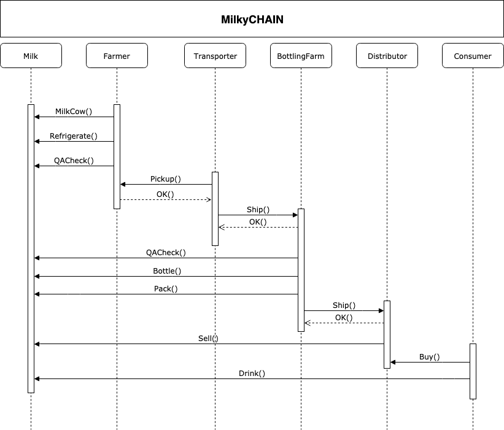

# 🥛 Blockchain-based Milk Supply Chain ⛓️

The project implements a **blockchain-enabled supply chain system** for milk, ensuring transparency, authenticity, and traceability from the **cow to the consumer**.  
It was published as both a **research paper** and an **implementation paper**, demonstrating the real-world applicability of blockchain in agricultural supply chains.

---

## 📑 Publications & Resources
- **Research Paper**: *A Study of Milk Supply Chain Using Blockchain Technology*, IJCRT, Jan 2025  
- **Implementation Paper**: *Milk Supply Chain Using Blockchain Technology*, MAT Journals, Jun 2025  

📂 All project documents, certificates, and reports:  
👉 [Google Drive Link](https://drive.google.com/drive/folders/1YkcJH4HGull5lm_LbcP_VZj3QXKY8M-6?usp=drive_link)

---

## 📌 Project Write-up – UML
The supply chain workflow implemented in this project:  

  

Other architecture diagrams are in the `/architecture` folder.

---

## 📚 Project Write-up – Libraries
This project uses the following smart contract libraries (credits to **OpenZeppelin** & **Truffle**):
- **Roles.sol** → Manages role-based access  
- **Ownable.sol** → Provides owner-based permissions  
- **Migrations.sol** → Simplifies deployment process  

---

## ⚙️ Getting Started
These instructions will install requirements and allow you to execute the code.

**Environment (recommended):**
- Node.js v14+ (original tested on Node v10.10.0)  
- Truffle v5+ (original used Truffle v4.1.15)  
- Ganache CLI or Ganache UI  

### Install Dependencies
```bash
npm install
Run Tests

Start Ganache in one terminal:

ganache-cli


Run smart contract tests:

truffle test


✅ Expected output:

Deploy SupplyChain and Register Actors

Execute functions: milkCow, refrigerate, onFarmInspect, pick, ship, bottle, pack, delivery, sellItem, buy, consumer

All tests should pass

Deploy Contracts

With Ganache running:

truffle migrate

🌐 UI

The following screenshots demonstrate the successful execution of the blockchain-based milk supply chain system:

1. **Smart Contract Deployment**  


3. **MetaMask Transaction Authorization**  
   

4. **Smart Contract Compilation**  


5. **Final Blockchain Transaction**  


🔑 Roles in the System

👨‍🌾 Farmer → Harvests, refrigerates, inspects milk

🚚 Transporter → Picks up & ships

🏭 Bottling Farm → Inspects, bottles, packs, delivers

🏪 Distributor → Sells packaged milk

🛒 Consumer → Buys & verifies authenticity

🌍 Deployed Contract on Rinkeby

Contract ID: 0x84E8edF4072165f86EF729B21E55656Bfdea1f91

Transaction ID: 0x45b106f553e9e94326b8cf842253dd506c913129f315fbe0c94f45be65d0af82

Etherscan View: Click Here

👨‍💻 Author

S. Nithin

Publications in IJCRT & MAT Journals

📜 License

This project is licensed under the MIT License.


